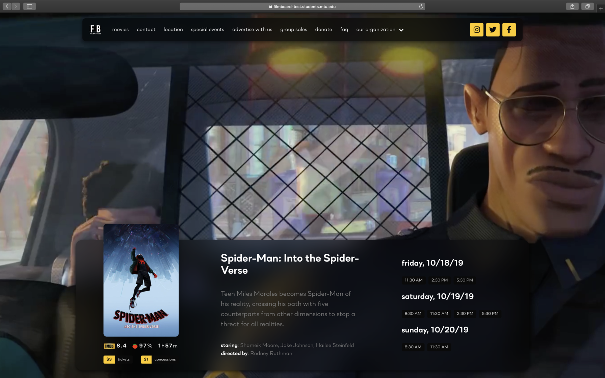

# 📽 The Michigan Tech Film Board's site

Built from scratch with [Next.js](https://nextjs.org/) and React.  Integrates a custom CMS with an easy-to-use interface for adding movies, showtimes, and editing pages.

### This vs. old site

Adding The Lion King on both versions with specific showtimes:

(It takes **183** seconds on the WordPress version and **45** on this version.)

### Developing

1. Clone repository.
2. Run `yarn install`.
3. Set up a PostgreSQL instance.
4. Copy `.env.example` to `.env` and fill with values.
5. Run `node modules/dev.js` to populate the database.
6. Run `yarn run dev` to start the development server.

### Deploying

To build, run `yarn run build`.  Note: environment variables will be compiled into the build, so don't make it public.

After building, the server can be started with `node app.js`.
